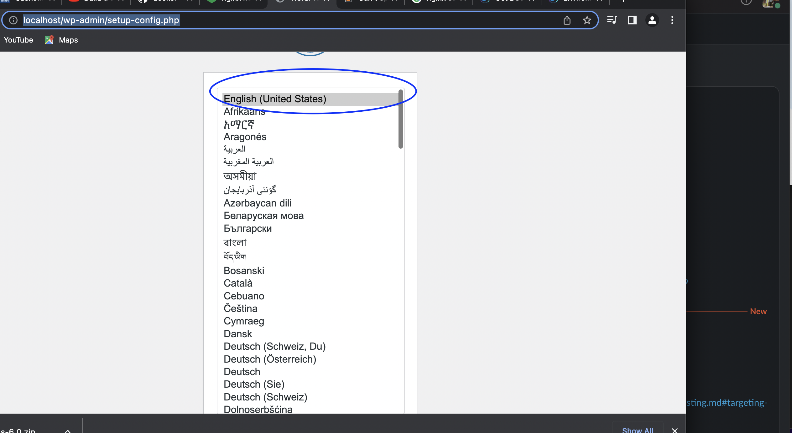
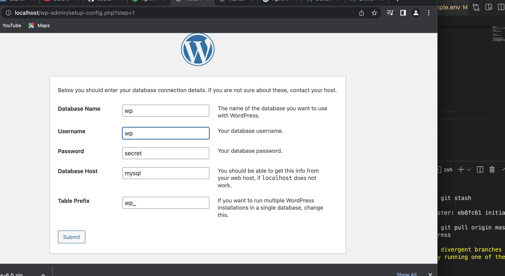

## Dependencies
- Docker
https://docs.docker.com/get-docker/

## How to Build
``` bash
$ docker-compose build
```

## How to Run
``` bash
$ docker-compose up -d
```

## Setting Up the Wordpress
1. Visit http://localhost
2. Choose language then press continue

3. Configure database, you can find the values needed from .env file, click submit.


4. After successful database setup, run the installation